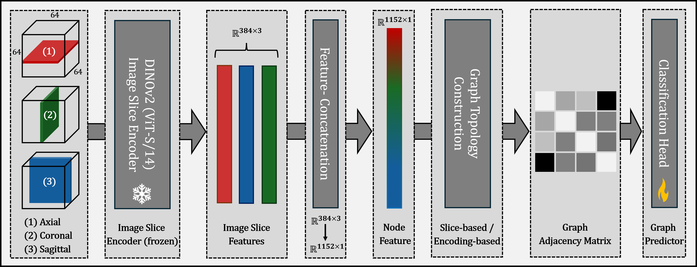

# Graph Neural Networks: A suitable Alternative to MLPs in Latent 3D Medical Image Classification?

Recent studies have underscored the capabilities of natural imaging foundation models to serve as powerful feature extractors, even in a zero-shot setting for medical imaging data. Most commonly, a shallow multi-layer perceptron (MLP) is appended to the feature extractor to facilitate end-to-end learning and downstream prediction tasks such as classification, thus representing the de facto standard. However, as graph neural networks (GNNs) have become a practicable choice for various tasks in medical research in the recent past, we direct attention to the question of how effective GNNs are compared to MLP prediction heads for the task of 3D medical image classification, proposing them as a potential alternative. In our experiments, we devise a subject-level graph for each volumetric dataset instance, where latent representations of all slices in the volume, encoded through a DINOv2 pretrained vision transformer (ViT), constitute the nodes and their respective node features. We use public datasets to compare the classification heads numerically and evaluate various graph construction and graph convolution methods in our experiments. Our findings show enhancements of the GNN in classification performance and substantial improvements in runtime compared to an MLP prediction head. Additional robustness evaluations further support the promising performance of the GNN, promoting them as a suitable alternative to traditional MLP classification heads.

  

